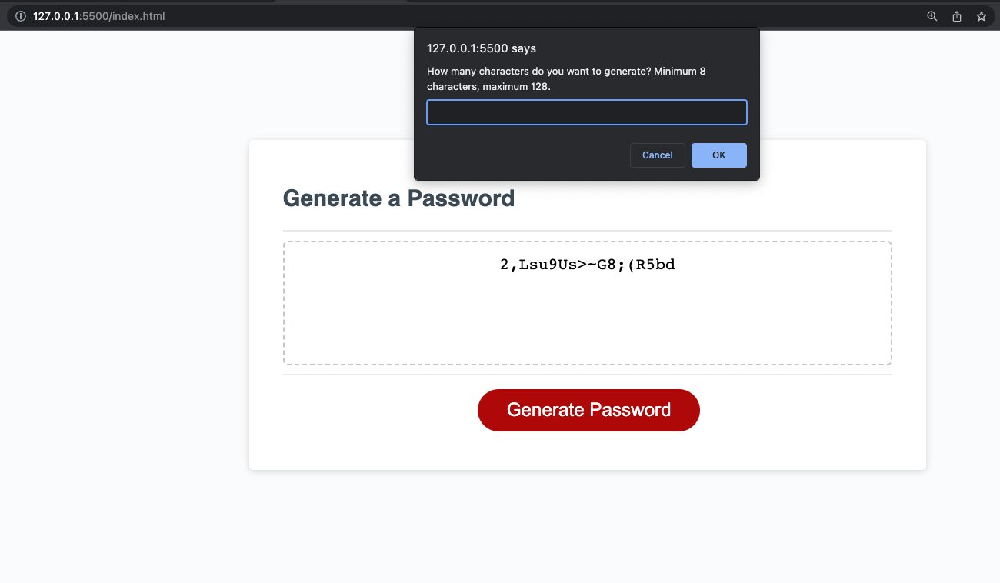

# covert_identification
Password Generator

## Description

A password generator that prompts user to select password parameters (length, and whether to include alpha-numeric values and special characters). 

## Usage
Deployed code at [Covert Identification](https://savannahvel.github.io/covert_identification/)

## Credits
Starter Code: Starter Code: https://github.com/coding-boot-camp/friendly-parakeet

## License
Please refer to the LICENSE in the repo.